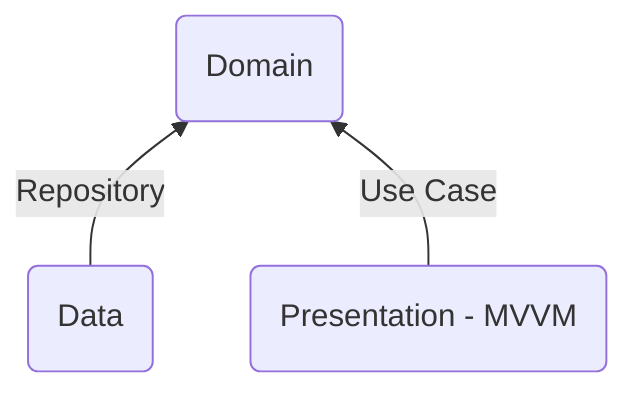

# WIP

# Description 📝

This project aims to develop a simple Android application using the best practices (up to date) that
most companies are trying to follow.

**Note:** If you have any improvement/suggestion, don't hesitate to reach me out or open an
issue/suggestion. Let's build something good together that anyone can benefit from. 🤖

# Technologies ⚒️

- Kotlin
- RxJava
- Retrofit
- Mockito
- Dagger - Hilt
- Jetpack Compose

# Decisions 🔀

- MVVM Architectural pattern **[TODO LINK]**
- Clean Architecture principles
    - S.O.L.I.D. **[TODO LINK]**

# Features 🌟

- Light/Dark mode
- Error - Retry
- Loading
- List of items
    - Click item -> Details
    - Swipe to refresh
    - Save scroll position on configration changes

# Testing 🚧

## Unit tests

- Mappers
- ViewModel
- UseCase
- Repository

## Instrumented tests

- Screenshot testing
- Error view
- Loading view
- List view
- Details view

# API 🔌

[JokeAPI - Documentation](https://jokeapi.dev/)
